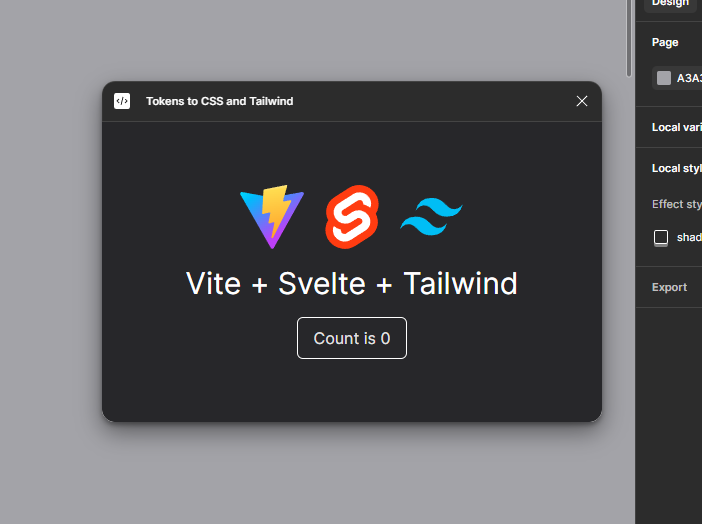

# Vite + Svelte + Tailwind + Typescript



A figma plugin template using Vite, Svelte 5, Tailwind, and Typescript

Init:
```sh
npm install
```

Turn on hot reloading in figma using `Plugins -> Development -> Hot reload plugin`

Dev and build:
```sh
npm run dev # live build, watches for file changes
# or
npm run build # single build, doesn't watch for file changes
```

Your figma API code should go in `src/code.ts`

The output files are `dist/index.html` and `dist/code.js`

Feel free to tweak the template to your liking, `vite.config.ts` is where the magic happens

[](https://ko-fi.com/sickl8)